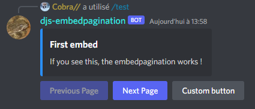

# EmbedPagination

<p>
    <a href="https://discord.gg/d8DTUfT"></a>
    <a href="https://www.npmjs.com/package/djs-embedpagination"></a>
</p>

## About
Allows you to create a simple and fully customizable embed pagination with [discord.js](https://github.com/discordjs/discord.js/) v14.

## Help
Need help ? Join my [Discord server](https://discord.gg/d8DTUfT) and send me a private message ! (Cobra//#5239 ; 619838036846575617)

## Docs
Create the pagination instance with your discord's client's user's id
```js
new EmbedPagination(clientId: string)
```

Set the user who own this pagination, and the optional error message for others
<br>If no errorMessage provided, everyone can use the pagination
```js
setUserId(userId: Snowflake, errorMessage?: string): this
```

Set the interaction or the message
```js
.setInteraction(interaction): this
or
.setMessage(message): this
```

Set the longevity (default to 1_200_000)
```js
.setTime(time: number): this
```

Set the navigation buttons labels
```js
.setLabels(label0: string, label1: string): this
```

Set additionnal rows to the message
```js
.setRows(rows: ActionRowBuilder<ButtonBuilder | SelectMenuBuilder>[]): this
```

Add an embed
```js
addEmbed(embed: EmbedBuilder | ((instance: this) => EmbedBuilder)): this
```

Set embeds
```js
setEmbeds(embeds: (EmbedBuilder | ((instance: this) => EmbedBuilder))[]): this
```

Add a button
```js
addButton(button: PaginationButton): this
```

Set buttons
```js
setButtons(buttons: PaginationButton[]): this
```

If true and if the pagination only contains 1 page, remove the navigation buttons
```js
autoRemoveUpdateButtons(value: boolean): this
```

Disable the navigation buttons
```js
disableUpdateButtons(state: boolean): this
```

Disable all the message components at the end of the collector
```js
disableAtEnd(state: boolean): this
```

Set a callback executed at each page change
```js
setUpdateCallback(callback: (instance: this, p: number) => void): this
```

Set a callback for your custom components
```js
setSpecialCallback(callback: (instance: this, i: MessageComponentInteraction | SelectMenuInteraction) => void): this
```

Update the pagination
```js
update(): void
```

Start the pagination
```js
start(page?: number): Promise<void>
```

Change the current page of the pagination (can be use in the callbacks)
```js
changePage(type: string, interaction: MessageComponentInteraction): void
```

## Basic Example (Slash Command)
```js
const { EmbedBuilder, ButtonBuilder, ButtonStyle } = require("discord.js");
const { EmbedPagination } = require("djs-embedpagination");

const embed = new EmbedBuilder()
    .setColor("#2a90fe")
    .setTitle("First embed")
    .setDescription("If you see this, the embedpagination works !");

const embed2 = new EmbedBuilder()
    .setColor("#2a90fe")
    .setTitle("Second embed")
    .setDescription("Hello world !");

new EmbedPagination(client.user.id)
    .setUserId(interaction.user.id, "You can't interact with this message !")
    .setInteraction(interaction)
    .setLabels("Previous Page", "Next Page")
    .setEmbeds([embed, embed2])
    .addButton({
        position: "Right",
        button: new ButtonBuilder()
            .setCustomId("custom-button")
            .setLabel("Custom button")
            .setStyle(ButtonStyle.Secondary)
    })
    .setSpecialCallback((instance, i) => i.reply("Clicked !"))
    .start();
```
Result:
<br>
